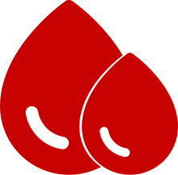

<h1><span style="color:#c70100">Blood</span> Donation</h1>

A frontend project where users can login, register and search for specific blood groups with location or donate blood to others.

## Used npm commands

```bash
# creating the project
npx create-react-app blood_donate

#starting development server
npm start

#installing node packages
npm install package-name --save
```

## Available npm commands

```bash
# install required dependancies
npm install

# start development server
npm start

# build the project
npm  run build
```

## Used Node packages

1. CSS Library - [antd 4.14.0](https://ant.design/)
2. Routing - [react-router-dom 5.2.0](https://reactrouter.com/web/guides/quick-start)
3. Google Map - [react-google-maps/api 2.1.1](https://react-google-maps-api-docs.netlify.app/)
4. Carousel - [infinite-react-carousel 1.2.11](https://github.com/g787543/infinite-react-carousel)
5. Icons - [react-icons 4.2.0](https://react-icons.github.io/react-icons)
6. Slider For Age Inpur - [rc-ruler-slider 1.1.2](https://github.com/YanYuanFE/react-ruler)

## Components

|         Name         |       ClassName       |                                             Image                                              |
| :------------------: | :-------------------: | :--------------------------------------------------------------------------------------------: |
|        Badges        |    BadgesContainer    |                                |
|       Campeign       |       campaign        |                            |
| CurrentNotifications | current-notifications |  |
| HistoryNotifications | history-notifications |  |
|         Home         |         home          |                                   |
|  LoggedInUserWidget  | logged-in-user-widget |            |
|       MapHome        |       map-home        |                             |
|         Menu         |         menu          |                          |
|    MobileSidebar     |    mobile-sidebar     |                 |
|    Notifications     |     notifications     |                 |
|       Profile        |        profile        |                             |
|     ProfileInfo      |     profile-info      |                      |
|      RequestTab      |      request-tab      |                       |
|       Sidebar        |        sidebar        |                             |
|       Welcome        |        welcome        |                             |
|        Signin        |        signin         |                               |
|        Signup        |        signup         |                              |
|    SignupContact     |    signup-contact     |                       |
|   SignupBloodGroup   |  signup-blood-group   |                    |
|     SignupWeight     |     signup-weight     |                        |
|     SignupGender     |     signup-gender     |                        |
|    SignupAddress     |    signup-address     |                       |
|      SignupAge       |      signup-age       |                           |
|     SignupUpload     |     signup-upload     |                        |
